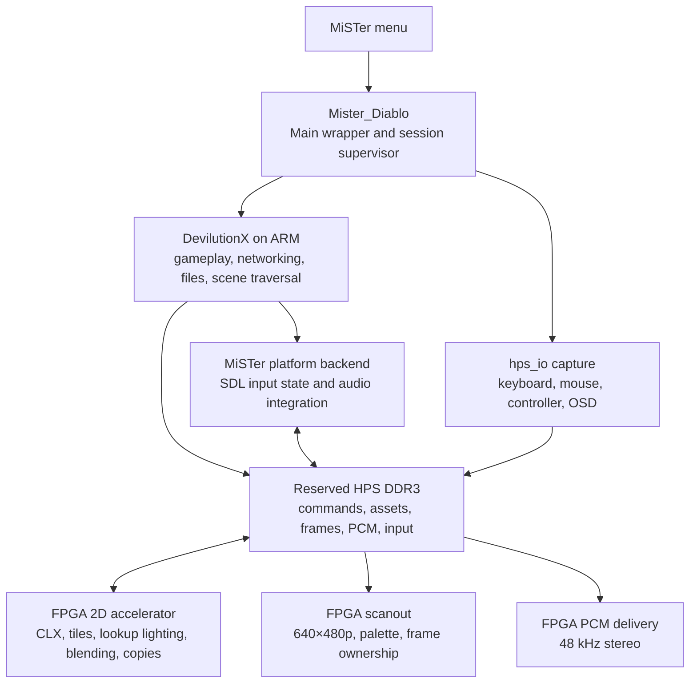

# Diablo for MiSTer: Detailed ARM + FPGA Hybrid Core Implementation Plan

**Planning date:** 5 September 2026  
**Project root:** `D:\Arcade\AI\aCORES\Diablo`  
**Primary donor:** `D:\Arcade\AI\aCORES\blood`  
**Private game data:** `D:\Arcade\AI\aCORES\Diablo\game`  
**Intended implementation-plan file:** `.mister/DIABLO_IMPLEMENTATION_PLAN.md`  
**Status:** Researched implementation specification. Supplied inline in Plan Mode; no project files have been written and no builds or performance tests have been run.

---

## 1. Summary and fixed decisions

Create a MiSTer core named **Diablo** that runs current DevilutionX game logic on the DE10-Nano’s ARM processor and uses the FPGA for native video, audio delivery, input transport, and substantial rendering acceleration.

Use the Blood core as the primary engineering donor. Start the public FPGA project from the official MiSTer template, then import the relevant Blood subsystems with their provenance and notices.

The finished implementation must provide:

- Diablo and Hellfire.
- Native **640×480 progressive** rendering and output.
- Approximately 60 Hz presentation, with a designed target of **60.000 Hz**.
- Full mouse and keyboard gameplay, menus, configuration, and text entry.
- Full controller gameplay, menus, inventory management, and controller-accessible text entry.
- Upstream supported multiplayer, including direct TCP networking.
- Normal launch from MiSTer’s menu.
- A dedicated Blood-style Main wrapper selected through `MiSTer.ini`.
- **No Frontier daemon, boot-time polling service, or separately started launcher service.**
- A permanent software rendering reference and recovery path.
- An FPGA accelerated rendering path whose correctness and performance are measured independently.

The ARM-only renderer with FPGA scanout is an **intermediate bring-up milestone**. It does not satisfy the completed acceleration objective by itself.

Do not obtain performance by lowering the internal resolution, changing game speed, dropping sound, removing controller functionality, or silently disabling graphical effects.

### 1.1 Meaning of “smooth”

Separate three different rates:

| Rate | Definition | Required behavior |
|---|---|---|
| Simulation | Game logic and network progression | Preserve DevilutionX’s configured behavior; default game speed is 20 ticks/s |
| Rendering | Images generated between simulation ticks | Preserve upstream interpolation and target one render opportunity per display refresh |
| Presentation | Complete images accepted for scanout | FPGA-controlled, tear-free, approximately 60 Hz |

Increasing rendering frequency must not accelerate combat, movement, animation logic, spell durations, or multiplayer time.

A 60 Hz raster alone does not prove 60 FPS gameplay. Performance reports must distinguish newly completed frames from repeated scanout of an older frame.

---

## 2. Sources, pinned identities, and donor decisions

### 2.1 Selected source baseline

The user selected current DevilutionX master rather than the latest stable release.

| Source | Pinned identity | Use |
|---|---|---|
| DevilutionX | `0ff3186238e7c2786c4d52c21ecce1cb83723ed9` | Game engine and behavioral reference |
| Blood local repository | `bebfa41a736cd56f09c54d8185b7b903f10a1646` | Primary ARM/FPGA integration donor |
| Template_MiSTer | `3ea1134cf05d62c2b1db30362277a823d739ced2` | Public core skeleton and framework |
| MiSTer_Frontier | `a7c61e0a000d9dfd40235e638229e06a603534d5` | Architecture and distribution reference |
| Frontier OpenBOR donor recorded by Blood | `e5ae42e7bde5ddb8ceb21572da068be00adc19b4` | Secondary transport provenance |
| openfpgaOS/Duke3D | `70fcda8a57878bc86b6f7e4a90f45e2a334b8c9a` | Command batching and accelerator integration reference |
| jsmolina/mister-duke3d | `bd7edf0ea0bed833f48457fafd36d30f913d6575` | Historical ARM deployment reference |
| MiSTer_DeViL | `c69c881914d44ae7dcc1d4d7c424d607890ef3f1` | Historical Diablo-on-MiSTer reference |
| Main wrapper donor recorded by Blood | `2b4e4b91441c047e2a574727d4c1b993fe45eadf` | Main replacement and engine supervision provenance |

The inspected DevilutionX revision identifies itself as **1.6.0-dev**. The latest tagged stable release observed during planning was **1.5.5**. Do not describe this planned build as an official 1.6.0 release. [Pinned DevilutionX version](https://github.com/diasurgical/DevilutionX/blob/0ff3186238e7c2786c4d52c21ecce1cb83723ed9/VERSION), [stable release](https://github.com/diasurgical/DevilutionX/releases/tag/1.5.5).

The initially observed local source ZIP had SHA-256:

```text
8236f0be397bf2095e2a9fdc75e05013b0e840dd638419964f6e861fdded4298
```

That archive is not the final source authority. Its equivalence to the selected upstream commit was not established before the directory contents changed.

### 2.2 Private game-data inventory

The final planning inspection found:

| File | Observed bytes |
|---|---:|
| `DIABDAT.MPQ` | 517,501,282 |
| `hellfire.mpq` | 65,502,336 |
| `hfmonk.mpq` | 37,658,368 |
| `hfmusic.mpq` | 34,379,360 |
| `hfvoice.mpq` | 37,743,520 |

These observations establish presence, not archive integrity or language/version compatibility.

During implementation:

1. Hash each archive.
2. Verify that the pinned engine can open the required archive members.
3. Record detected game-data variants.
4. Keep the directory read-only to build and packaging operations.
5. Never include these archives in Git, downloadable releases, CI uploads, or public test fixtures.

Create the DevilutionX source checkout separately from this directory.

### 2.3 What to take from Blood

Use these Blood components as the starting reference:

| Subsystem | Relevant donor location | Adaptation |
|---|---|---|
| Main wrapper | `platform/mister/wrapper/` | Rename identity and paths; improve lifecycle handling |
| Shared DDR transport | `platform/mister/frontier_transport.c` | Ownership, publishing, fences, acknowledgment patterns |
| Shared ABI | `platform/mister/frontier_memmap.h` | Starting evidence; replace with a generated Diablo contract |
| Video bridge | `platform/mister/mister_video.c` | Indexed frame publication |
| Input bridge | `platform/mister/mister_input.c` | Raw transport concepts, not BUILD key semantics |
| Write-combining driver | `platform/mister/kmod/frontier_wc.c` | Controlled bulk-memory mapping |
| FPGA reader | `fpga/rtl/openbor_video_reader.sv` | DDR transactions, scanout, PCM, input capture |
| Timing generator | `fpga/rtl/openbor_video_timing.sv` | Counter and pipeline structure |
| Focused verification | `fpga/sim/` and `tools/` | Adapt applicable transport, cadence, and input tests |

Blood’s current source and older architecture documents disagree in several places. For example, the current header supports 640×480 indexed frames while older documentation still describes 320×200 behavior.

**Implementation rule:** establish facts from the selected source revision and matching receipts. Use documentation as context, not as a substitute for inspecting the active implementation.

### 2.4 What not to transplant from Blood

Exclude:

- NBlood and BUILD engine code.
- BUILD-specific scan-code translation.
- OPL3 synthesis and register handshakes.
- Blood-specific OSD settings.
- Blood save/configuration migration rules.
- 320×240 rendering modes.
- Historical crop and replication paths.
- Stale address constants and diagnostic probes.
- Timeout recovery that can reuse a buffer before ownership is proven.
- Unconditional engine respawn after a deliberate user quit.

Removing these components must be an explicit, independently reviewed integration change.

### 2.5 Secondary donor disposition

**MiSTer_Frontier**

Use its hybrid architecture and source organization as reference material. Its current standard installation includes a background helper. Do not import that launch mechanism. [Frontier architecture and installer](https://github.com/MiSTerOrganize/MiSTer_Frontier/tree/a7c61e0a000d9dfd40235e638229e06a603534d5).

**openfpgaOS/Duke3D**

Use its batching, capability checks, fences, and performance counters as engineering examples. Its runtime also targets a RISC-V-based FPGA platform; that runtime is not the selected ARM architecture.

Its GPU integration contains a recovery path that drops drawing work during stalls. Do not copy that behavior: Diablo must retain the previous complete frame instead of presenting an incomplete replacement. [GPU integration source](https://github.com/openfpgaOS/Duke3D/blob/70fcda8a57878bc86b6f7e4a90f45e2a334b8c9a/src/duke3d/d3d_gpu.c).

**jsmolina/mister-duke3d**

The inspected launcher uses a script, SDL libraries, and `vmode`. Treat it as a historical deployment example, not as proof of FPGA rendering acceleration. [Launcher source](https://github.com/jsmolina/mister-duke3d/blob/bd7edf0ea0bed833f48457fafd36d30f913d6575/Duke3D.sh).

**MiSTer_DeViL**

This archived project describes itself as an ARM Linux port and provides a useful historical compatibility reference. It is not the current engine baseline or the accelerator donor. [Archived project](https://github.com/raetro-archives/MiSTer_DeViL/tree/c69c881914d44ae7dcc1d4d7c424d607890ef3f1).

---

## 3. Evidence and licensing rules

### 3.1 Evidence labels

Use these labels consistently:

- **KNOWN:** directly observed in pinned source, validated transactions, reports, or hardware measurements.
- **INFERRED:** a proposed design conclusion supported by evidence but awaiting its acceptance test.
- **HYPOTHESIS:** a possible performance cause or optimization awaiting measurement.

The proposed accelerator is newly designed hardware implementing software rendering operations. Do not describe it as a recovered Diablo graphics chip or claim original-PC hardware equivalence.

Use pinned DevilutionX as the functional rendering and gameplay reference. A MAME arcade driver is not the appropriate reference for this project.

### 3.2 Mandatory change record

Before material hardware changes, record:

```text
Observation:
Evidence:
Hypotheses:
Selected explanation:
Smallest change:
Verification:
Regression scope:
Known unknowns:
```

For accelerator additions, the observation can be a measured CPU cost and the selected explanation can be an independently tested operation contract.

A source-level idea alone is insufficient justification for a broad architectural rewrite.

### 3.3 Licenses require component-level handling

The selected DevilutionX master uses the **Sustainable Use License**, which places conditions on use and distribution. Preserve the license and modification notices. Do not label the complete project GPL merely because the MiSTer framework or Blood wrapper uses GPL terms. [Pinned DevilutionX license](https://github.com/diasurgical/DevilutionX/blob/0ff3186238e7c2786c4d52c21ecce1cb83723ed9/LICENSE.md).

Implementation requirements:

1. Maintain a file-level provenance inventory.
2. Preserve the Main wrapper’s notices.
3. Preserve FPGA framework and donor notices.
4. Keep the wrapper and game engine as separate executables.
5. Define the communication protocol independently.
6. Do not copy GPL Blood userspace implementation code directly into DevilutionX without resolving the applicable licensing requirements.
7. Implement the DevilutionX-side adapter from the documented protocol where necessary.
8. Resolve any incompatible combination before public distribution.
9. Do not distribute commercial game assets.

Separate-process architecture does not automatically settle every licensing question; record the actual code composition.

---

## 4. Target architecture



### 4.1 ARM responsibilities

Keep these functions on ARM:

- Gameplay simulation.
- AI and pathfinding.
- Collision and interaction logic.
- Quest and item state.
- Random-number generation.
- Save/load and configuration.
- Multiplayer.
- MPQ access and decompression.
- Asset validation and lifetime management.
- Scene traversal and drawing order.
- Controller action interpretation.
- Text shaping and UI layout.
- Initial audio decoding, mixing, and resampling.
- Render-command generation.
- Software reference rendering.

Do not move gameplay onto FPGA merely to increase the offload percentage.

### 4.2 FPGA responsibilities

Required presentation functions:

- Video timing.
- Completed-frame selection.
- Indexed-pixel fetch.
- Full-precision palette lookup.
- Audio ring consumption.
- Keyboard, mouse, and controller capture.
- Input event transport.
- DDR arbitration and deadline counters.

Required acceleration development:

- Rectangle fills and copies.
- Indexed blits.
- CLX decoding and drawing.
- Dungeon tile primitives.
- Color translation and lighting lookups.
- Exact indexed blending.
- Frequently used UI and cursor operations.
- Destination caching and writeback.
- Command completion fences.

Additional acceleration is admitted only through the profiling rules in Section 12.

### 4.3 Hardware requirements

Initial supported target:

- DE10-Nano / Cyclone V SoC.
- Existing MiSTer Linux environment.
- HPS DDR3.
- HDMI output.
- Analog 31 kHz progressive output on applicable MiSTer hardware.
- USB or other controllers supported by MiSTer Main.

Do not require an external SDRAM module for this design unless later evidence establishes a necessary benefit and the requirement is explicitly revised.

Pocket, MiST, SiDi, and unrelated FPGA boards are outside this plan.

---

## 5. Repository, build, and source organization

### 5.1 Public FPGA project

Preserve the official template’s structure:

```text
Diablo.qpf
Diablo.qsf
Diablo.srf
Diablo.sdc
Diablo.sv
files.qip
clean.bat
.gitignore
README.md
LICENSE / component license notices

sys/                    Unmodified pinned MiSTer framework
rtl/                    Diablo-specific FPGA integration and accelerator
releases/               Accepted release artifacts
```

Use one coherent Quartus project and revision named `Diablo`.

Place the HPS implementation and development tooling under a small, declared integration area, for example:

```text
support/
  hps/
    wrapper/
    backend/
    kmod/
  integration/
  scripts/
  sim/
  tests/

.mister/
  source-lock.json
  contracts/
  scenarios/
  evidence/
  state.json
  rbf-build.json

game/                   Existing private user data; ignored
```

Keep the upstream DevilutionX checkout in an ignored development directory referenced by the source lock. Do not overwrite or repurpose `game/`.

Do not copy Blood’s entire repository layout or add a public `docs/` tree.

### 5.2 Source lock

Record:

- Source URLs and commits.
- Archive hashes.
- Dependency hashes.
- Local patch inventory and patch hashes.
- Toolchain identity.
- Target sysroot identity.
- Template identity.
- Blood identity.
- Build options.
- Generated ABI digest.
- Ordered FPGA source closure.

Fetches must resolve to locked content. No unattended tracking of `master`, `latest`, or moving container tags after initialization.

### 5.3 ARM build

The selected DevilutionX source requires **C++23** and CMake **3.22 or newer**. Blood’s existing compiler setup must not be assumed sufficient. [Pinned build configuration](https://github.com/diasurgical/DevilutionX/blob/0ff3186238e7c2786c4d52c21ecce1cb83723ed9/CMakeLists.txt).

Required build characteristics:

- ARMv7-A.
- Cortex-A9 tuning.
- Hard-float ABI.
- NEON where supported by the operation.
- Release optimization.
- No `-ffast-math`.
- No unproven strict-aliasing workarounds.
- No runtime dependencies requiring a newer target Linux environment than the supported MiSTer image.

Use a locked cross-toolchain capable of the required C++23 library facilities. GCC 14.2 is the initial toolchain target; validate its produced binaries against the actual MiSTer sysroot before engine integration.

If the toolchain cannot build and run the required library probe, stop at that gate. Do not downgrade language requirements or patch out upstream features to get a misleading successful compile.

### 5.4 SDL choice

Use **SDL2**, not SDL1, for the initial target.

Set:

```text
USE_SDL1=OFF
USE_SDL3=OFF
NONET=OFF
DISABLE_TCP=OFF
DISABLE_DEMOMODE=OFF
NOSOUND=OFF
```

Use the engine’s pinned SDL2 dependency: **2.32.8**, with its declared SHA-256. Preserve the pinned SDL_audiolib integration initially. [SDL2 dependency pin](https://github.com/diasurgical/DevilutionX/blob/0ff3186238e7c2786c4d52c21ecce1cb83723ed9/3rdParty/SDL2/CMakeLists.txt).

The SDL MiSTer backend must use FPGA output directly. It must not require X11, Wayland, a Linux framebuffer display, ALSA output, or direct engine access to evdev devices.

### 5.5 Build variants

Maintain separate variants:

| Variant | Purpose |
|---|---|
| `reference-host` | Upstream software rendering and fixture export |
| `reference-arm` | ARM behavior and performance without FPGA raster acceleration |
| `mister-software` | Actual MiSTer transport with software rasterization |
| `mister-accelerated` | Actual MiSTer transport with accepted FPGA acceleration |
| `rtl-strict` | Headless Verilator verification |
| `rtl-trace` | Same semantics with bounded trace capture |
| `release` | Accepted ARM, wrapper, driver, and RBF combination |

A throughput-only build must never supply an accuracy or release verdict.

---

## 6. Daemon-free launch and session lifecycle

### 6.1 Installed layout

Use:

```text
/media/fat/Mister_Diablo
/media/fat/_Computer/Diablo.rbf

/media/fat/games/Diablo/
    devilutionx
    required redistributable engine assets
    user-supplied MPQ files
    config/
    saves/
    cache/
    modules/

/media/fat/logs/Diablo/
```

The source repository retains dated accepted RBFs under `releases/`. The package installer resolves the selected accepted artifact to the installed core entry.

Do not create an MRA solely to make this application look like an arcade ROM-loading core. If an MRA is later introduced for a specific integration reason, it must have its own validated contract.

### 6.2 MiSTer configuration

Use Blood’s selected Main-wrapper pattern:

```ini
[Diablo]
main=Mister_Diablo

[Mister_Diablo]
main=Mister_Diablo
```

Verify the exact executable lookup behavior in the supported Main revision. Blood’s newer installation documentation and older wrapper notes disagree about path resolution; test the real handoff instead of reproducing that ambiguity.

### 6.3 Startup state machine

Implement:

```text
START
  → initialize logging
  → initialize Main services
  → identify loaded FPGA core
  → verify wrapper/engine/RBF compatibility
  → establish safe memory mapping
  → release the inherited core-reset state correctly
  → wait for FPGA protocol readiness
  → validate game data and writable directories
  → launch engine once
  → RUNNING
```

Requirements:

1. Continue servicing OSD and input while the engine starts.
2. Use argument arrays with `execve`, not constructed shell commands.
3. Pass explicit data, configuration, and save directories.
4. Distinguish missing data from a crashed engine.
5. Display actionable startup errors through the session UI.
6. Do not clear another core’s memory or kill unrelated processes.
7. Do not treat a fixed sleep as proof that the FPGA is ready.

### 6.4 Process and CPU ownership

Initial placement:

- Main wrapper and support work: CPU0.
- DevilutionX main simulation/render-command thread: CPU1.
- Audio and bounded I/O workers: CPU0 initially.

Measure contention before changing placement.

Do not inherit CPU affinity accidentally from the wrapper into every engine worker. Assign affinity explicitly after thread creation where needed.

Use normal scheduling initially. Do not introduce an unrestricted real-time thread or a busy polling loop.

### 6.5 Clean shutdown

Implement a session control channel between wrapper and engine.

For quit, reset, or core switch:

1. Request a normal engine shutdown.
2. Stop accepting new gameplay input.
3. Complete applicable normal save/configuration operations.
4. Stop new render submission.
5. Quiesce audio.
6. Wait for a bounded shutdown acknowledgment.
7. Reap the child process.
8. Release the session’s resources.
9. Return to stock Main or perform the selected reset.

The signal handler only records a request or wakes the main loop. It must not perform complex saving directly inside the handler.

Differentiate:

- Deliberate engine quit.
- Core reset.
- Core switch.
- Missing assets.
- Recoverable startup error.
- Crash.

A deliberate quit must not enter an automatic respawn loop.

### 6.6 Write-combining module lifecycle

A kernel module is not a daemon.

The wrapper may load the matching memory-mapping module when this session starts. No user should need to run a service beforehand.

Requirements:

- Verify kernel compatibility.
- Verify the permitted physical aperture.
- Report whether write-combining is active.
- Keep control and bulk-data mapping attributes explicit.
- Refuse unsafe memory configurations.
- Allow a correctness fallback where safe.
- Mark performance as unqualified if the fallback misses the performance gate.
- Do not unload a module still used by another legitimate client.
- Do not replace the user’s kernel automatically.

Blood’s measured write-combining improvement is donor evidence, not a guaranteed Diablo result. Re-run the measurement on this implementation. [Blood performance notes](D:/Arcade/AI/aCORES/blood/docs/PERFORMANCE.md).

### 6.7 Daemon-free acceptance

On a clean supported MiSTer installation:

- No Frontier daemon is installed or running.
- No game-launch watcher is present.
- Selecting Diablo starts the wrapper and game.
- Returning to the menu leaves no Diablo engine process behind.
- Selecting another core works.
- Re-entering Diablo works repeatedly.
- An engine crash leaves the OSD usable.

---

## 7. ARM–FPGA protocol and memory ownership

### 7.1 New Diablo ABI

Create a versioned **Diablo Hybrid ABI v1**.

Do not retain Blood’s register layout accidentally. Preserve donor protocol concepts while defining the new fields deliberately.

One declarative specification must generate:

- C/C++ constants and packing helpers.
- SystemVerilog constants.
- Host-side validators.
- Walking-bit fixtures.
- Human-readable field documentation.

Generated outputs belong to the declared source manifest and must be checked for reproducibility.

### 7.2 Required protocol interfaces

| Interface | Producer | Consumer |
|---|---|---|
| Host configuration | ARM | FPGA |
| FPGA identity/capabilities | FPGA | ARM |
| Render command stream | ARM | FPGA |
| Render completion/fault status | FPGA | ARM |
| Frame presentation request | ARM/session renderer | FPGA scanout |
| Displayed-frame feedback | FPGA | ARM |
| PCM write position | ARM | FPGA |
| PCM read position | FPGA | ARM |
| Input events and snapshots | FPGA | ARM |
| Input consumer position | ARM | FPGA |
| Diagnostic counters | Owning subsystem | Read-only collectors |

Required identity fields:

- ABI magic.
- ABI major/minor.
- Structure sizes.
- Core/build identity.
- Capability bits.
- Session epoch.
- Command sequence.
- Frame sequence.
- Fault status.

A major-version mismatch must produce a controlled startup error.

### 7.3 Memory aperture

Use Blood’s existing base, `0x3A000000`, as the **candidate base**.

The proposed accelerated allocation is **16 MiB**, ending at `0x3B000000`.

This is an allocation proposal, not a claim that the whole range is already reserved.

Before enabling it:

1. Inspect target RAM size and boot arguments.
2. Inspect the kernel memory map.
3. Inventory the pinned Main and framework DDR regions.
4. Check framebuffer, scaler, rotation, and save-state reservations.
5. Verify the core’s DDR address width.
6. Confirm no competing active owner.
7. Run bounded sentinel tests within the approved aperture.

If any check fails, startup must refuse the unsafe mapping. Do not silently write there or relocate to a guessed address.

### 7.4 Proposed allocation

All offsets are relative to the approved base.

| Offset | Allocation | Purpose |
|---|---:|---|
| `0x000000` | 64 KiB | Control, identity, status, ownership |
| `0x010000` | 64 KiB | Input events and snapshots |
| `0x020000` | 64 KiB | PCM ring |
| `0x030000` | 64 KiB | Presentation descriptors and palettes |
| `0x040000` | 320 KiB slot | Frame slot 0 |
| `0x090000` | 320 KiB slot | Frame slot 1 |
| `0x0E0000` | 320 KiB slot | Frame slot 2 |
| `0x130000` | 320 KiB slot | Persistent rendering surface |
| `0x180000` | 512 KiB | Dynamic staging and scratch |
| `0x200000` | 256 KiB | Render command ring |
| `0x240000` | 256 KiB | Versioned lookup tables |
| `0x280000`–`0xFFFFFF` | Remaining aperture | Asset cache |

Each 640×480 indexed image occupies exactly **307,200 bytes**. Padding in each slot is outside the visible image and must not appear as an extra scanline.

The allocator must validate actual object sizes. Scratch or lookup-table overflow triggers an explicit unsupported-path/fallback decision; it must not overwrite adjacent allocations.

### 7.5 Cache and ordering rules

Separate control pages from bulk-data pages:

- Control pages use the verified control-memory attributes.
- Bulk frame, asset, and command pages may use write-combining.
- Do not create cached and uncached aliases to the same physical pages.
- Do not assume `volatile` provides hardware coherence.
- Do not assume a compiler fence drains posted writes.
- Do not assume a 64-bit userspace write is atomic on ARMv7.

For publication:

1. Write complete payload.
2. Perform the verified architecture/driver publication barrier.
3. Publish the final aligned 32-bit sequence or producer field.
4. FPGA consumes only complete published entries.

For FPGA completion:

1. Complete all relevant memory operations.
2. Drain required destination-cache writes.
3. Satisfy the controller’s ordering contract.
4. Publish the completion sequence last.

Prove visibility with actual producer/consumer tests on hardware.

### 7.6 Ownership granularity

- Give each control cache line one writer.
- Do not let ARM and FPGA write different halves of the same shared word.
- Use byte enables correctly for partial data writes.
- Use sequence protection for multiword snapshots.
- Test sequence wrap and torn-read rejection.
- Carry a session epoch through every reusable resource.

### 7.7 Frame ownership

Use three presentation slots, with states:

```text
FREE → WRITING → READY → DISPLAYING → FREE
```

Rules:

- Never render into the displayed slot.
- Never overwrite an accepted ready slot.
- Never free a slot merely because a timeout elapsed.
- A frame includes its palette and palette generation.
- Latch frame identity and palette together.
- Change scanout ownership only at the defined frame boundary.
- Limit the ready queue to one frame to prevent unnecessary latency.
- Repeat the previous complete frame when no replacement is ready.
- Count every missed presentation opportunity.

The persistent render surface is separate from the currently displayed image. This preserves dirty-panel and cursor restoration behavior without writing into scanout.

---

## 8. Native video and frame pacing

### 8.1 Output contract

Required default:

| Parameter | Target |
|---|---:|
| Visible width | 640 pixels |
| Visible height | 480 lines |
| Pixel representation | 8-bit indexed |
| Palette representation | 256 × RGB888, stored in 32-bit entries |
| Aspect | 4:3 |
| Scan type | Progressive |
| Horizontal total | 800 pixels |
| Vertical total | 525 lines |
| Pixel clock target | 25.2 MHz |
| Refresh target | 60.000 Hz |
| Horizontal sync rate | 31.5 kHz |

Use VGA-style geometry:

- Horizontal front porch: 16.
- Horizontal sync: 96.
- Horizontal back porch: 48.
- Vertical front porch: 10.
- Vertical sync: 2.
- Vertical back porch: 33.

These are designed presentation timings. They are not a recovered Diablo PCB timing specification.

Generate the required clock through core-owned, tool-generated PLL integration. A 50.4 MHz video clock with a constant divide-by-two pixel enable is the initial target.

Do not hand-edit MiSTer’s HDMI PLL or vendored framework IP.

### 8.2 Palette precision

Blood currently transports an RGB565 palette. Diablo must preserve the full RGB values produced by the selected engine.

Use explicit palette-byte ordering:

```text
32-bit palette word = 0x00RRGGBB
```

Compare RGB888 before optional MiSTer gamma/scaler processing.

Test:

- Palette entry 0.
- Entry 255.
- Independent red, green, and blue ramps.
- Fades.
- Gamma/brightness changes.
- Water/lava cycling.
- Hellfire palette variants.
- Palette-only updates.

Never assume palette index zero means transparency. Transparency depends on the rendering operation.

### 8.3 Scanout buffering

Fetch indexed pixels in bursts into line buffers.

A 640-pixel indexed line contains 80 64-bit words. For the selected timing, one line lasts approximately 31.75 μs.

Initial implementation:

- Two line buffers.
- Explicit line tags.
- Explicit frame epochs.
- Separate validity and ownership.
- Prefetch next line while displaying current line.
- Detect missing or late data.
- Never allow a late completion from an old frame to replace current data.

On underflow, preserve sync, increment a fault counter, and expose the error. Do not hide it by changing raster totals.

### 8.4 Bandwidth baseline

At 60 Hz:

| Transfer | Approximate bandwidth |
|---|---:|
| One indexed frame stream | 18.432 MB/s |
| One 32-bit RGB frame stream | 73.728 MB/s |
| Full 32-bit palette every frame | 61.44 kB/s |
| Stereo S16 PCM at 48 kHz | 192 kB/s |

These exclude rendering overdraw, cache misses, command traffic, and framework traffic.

The accelerator bandwidth model must include destination reads for blending, destination writeback, source fetches, and scanout. Quoting only framebuffer bandwidth is insufficient.

### 8.5 Single pacing authority

Use FPGA frame feedback as the presentation pacing authority.

Modify the MiSTer-specific presentation path around `RenderPresent()` and its limiter integration so that:

- There is one effective display limiter.
- No second SDL delay loop beats against the FPGA.
- No engine-side “skip publish” workaround leaves rendering uncapped.
- Rendering deadlines derive from actual accepted/displayed frames.
- Input and network processing continue during bounded waits.
- Audio delivery never waits for VBlank.

The relevant source seam is `Source/engine/dx.cpp`; rendering calls reach it from `DrawAndBlit()` and other UI/video paths. [Presentation implementation](https://github.com/diasurgical/DevilutionX/blob/0ff3186238e7c2786c4d52c21ecce1cb83723ed9/Source/engine/dx.cpp).

### 8.6 Preserve upstream visual behavior

- Default to native 640×480.
- Disable automatic desktop-fit resolution changes on this platform.
- Do not introduce dynamic resolution scaling.
- Keep upstream zoom as an intentional user feature, not a hidden performance mechanism.
- Maintain menus, loading screens, cinematics, cursor, screenshots, and palette fades.
- Handle non-gameplay presentation paths explicitly.

Do not set upstream `HeadlessMode` as a shortcut for the game-rendering tests: it skips important drawing paths.

---

## 9. Mouse, keyboard, and controller support

### 9.1 Input route

Use:

```text
Physical devices
  → session Main wrapper
  → standard hps_io transport
  → FPGA capture
  → shared event ring/snapshot
  → MiSTer SDL backend
  → DevilutionX controls
```

Do not make the engine a second direct evdev reader. Blood’s shared lesson documents why MiSTer’s exclusive input grab makes that unreliable.

### 9.2 FPGA capture

Capture input independently of the render cadence.

Implement:

- Keyboard event FIFO.
- Mouse button edge events.
- Cumulative signed mouse X/Y counters.
- Cumulative wheel counter.
- Controller button edges.
- Left and right analog-stick state.
- OSD/focus state.
- Overflow counters.
- Sequence numbers and timestamps.

Initial sizes:

- FPGA ingress FIFO: 256 events.
- DDR event ring: 1,024 entries.
- Event size: 16 bytes.
- Snapshot service target: at least 1 kHz while active, subject to bounded arbitration.

The 1 kHz target concerns delivery of events already received by `hps_io`. It does not claim to increase the polling rate of the physical device or Main.

### 9.3 Events versus snapshots

Use events for transitions that can disappear between snapshots:

- Key press/release.
- Mouse button press/release.
- Controller button press/release.

Use cumulative counters or snapshots for:

- Mouse movement.
- Wheel movement.
- Analog positions.
- Current held state.

Do not lose a complete click that occurs between two rendered frames.

After overflow:

1. Record the error.
2. Resynchronize held state.
3. Release any state that cannot be trusted.
4. Avoid permanent stuck keys/buttons.
5. Fail the input stress gate.

### 9.4 Keyboard

Translate PS/2 set-2 transport to SDL physical scancodes and logical key events.

Do not reuse BUILD’s set-1 key table as the engine-facing mapping.

Cover:

- Alphabetic and numeric keys.
- Function keys.
- Modifiers.
- Keypad.
- Navigation.
- Extended keys.
- Press/release ordering.
- Repeat.
- Simultaneous keys.
- Text entry.
- Remapping.

Provide a documented default keyboard layout and keep physical key identity separate from generated text.

### 9.5 Mouse

Support:

- Relative motion.
- Left/right/middle buttons.
- Wheel.
- Additional buttons where supplied by the pinned Main/`hps_io` path.
- Click, double-click, drag, and held actions.
- Inventory manipulation.
- Character creation and menu interaction.
- Correct cursor confinement to 640×480.

Verify sign extension and Y-axis convention with directed tests.

Do not assume `ps2_mouse_ext` is only a wheel field; the inspected donor also exposes reserved/additional-button information. Confirm its producer mapping before claiming extra-button support.

### 9.6 SDL state must agree with events

A queue-only implementation is insufficient. SDL documents that `SDL_PushEvent()` does not update the device’s internal state. [SDL2 event contract](https://wiki.libsdl.org/SDL2/SDL_PushEvent).

Implement the MiSTer SDL input backend so that:

- Event delivery.
- Keyboard state queries.
- Modifier state.
- Mouse state queries.
- Controller polling.

all reflect the same input state.

Use the pinned SDL driver integration for keyboard/mouse state updates rather than scattering replacement state queries throughout DevilutionX.

### 9.7 Controller integration

Expose a standard virtual SDL2 game controller.

SDL2 provides virtual joystick attachment and state-setting APIs suitable for this boundary. Apply updates before the event pump consumes them. [Virtual joystick attachment](https://wiki.libsdl.org/SDL2/SDL_JoystickAttachVirtualEx), [virtual axis updates](https://wiki.libsdl.org/SDL2/SDL_JoystickSetVirtualAxis).

Provide:

- D-pad.
- Two sticks.
- Face buttons.
- Shoulders.
- Trigger actions.
- Start/back.
- Stick clicks where available.
- Native DevilutionX controller action mappings.
- Remapping.
- Correct active-device switching.
- Disconnect/reconnect handling.

Do not translate a gamepad into mouse movement as the primary gameplay interface.

MiSTer may expose trigger actions digitally for some devices. Preserve every gameplay action, but report actual analog resolution instead of inventing trigger precision.

### 9.8 Controller-only completeness

A controller user must be able to:

1. Select Diablo or Hellfire.
2. Create a character.
3. Enter a character name.
4. Navigate all menus.
5. Move and interact.
6. Attack and cast.
7. Select spells.
8. Use potions and belt slots.
9. Manage inventory and equipment.
10. Trade with NPCs.
11. Read dialogs.
12. Save, load, and quit.

If the pinned desktop controller path lacks a usable text-entry surface on MiSTer, add a controller-operated text-entry overlay at the platform/UI boundary.

### 9.9 OSD focus

When OSD captures input:

- Stop forwarding gameplay actions appropriately.
- Clear or reconcile held actions.
- Prevent accidental clicks on return.
- Preserve cumulative-counter baselines.
- Keep audio and display alive.
- Do not pause a multiplayer simulation merely because OSD is open.

Reserve the MiSTer menu binding consistently and make conflicting game bindings remappable.

---

## 10. FPGA renderer design

### 10.1 Integration boundaries

Inspect and adapt these operation families:

| Engine area | Purpose |
|---|---|
| `Source/engine/render/clx_render.cpp` | Sprites, translated sprites, blends, outlines |
| `Source/engine/render/dun_render.cpp` | Dungeon tile primitives |
| `Source/engine/render/blit_impl.hpp` | Pixel fill/copy/map/blend semantics |
| `Source/engine/render/light_render.*` | Lighting maps and lookup behavior |
| `Source/engine/render/primitive_render.cpp` | Lines, fills, UI primitives |
| `Source/engine/surface.*` | Surface regions, clipping, copies |
| `Source/engine/render/scrollrt.cpp` | Draw order, viewport, panels, cursor |
| `Source/engine/palette.cpp` | Palette and lookup generations |

These are integration seams, not permission to rewrite the whole renderer.

### 10.2 Preserve scene traversal

Keep the existing engine responsible for deciding:

- Which objects are visible.
- Their order.
- Their destination positions.
- Which translation/light tables apply.
- Which clip rectangle applies.
- Which panels need updating.

The FPGA executes the resulting drawing operations in order.

Do not sort operations by texture, palette, or primitive unless exact equivalence is demonstrated for that specific group.

### 10.3 Backend abstraction

Introduce a small rendering interface with:

```text
BeginFrame
RegisterSurface
RegisterAsset
RegisterLookupTable
SubmitOperations
AcquireCpuSurfaceAccess
ReleaseCpuSurfaceAccess
EndFrame
WaitFence
GetCounters
```

Implement two executors:

1. Software executor using the pinned operation semantics.
2. FPGA executor using the command stream.

The original renderer remains available as an independent reference. The new software executor must first match it.

### 10.4 Surface ownership is mandatory

`Surface::at()`, raw pixel pointers, direct memory operations, and SDL surface blits can bypass an accelerator abstraction.

Audit all writes and reads to accelerated surfaces.

Assign each operation one of:

- GPU-owned operation.
- CPU-only operation on a separate surface.
- Explicit CPU access to an accelerated surface.
- Immutable asset upload.
- Readback for diagnostics or screenshots.

For CPU access to a GPU-owned surface:

1. Flush preceding commands.
2. Wait for their fence.
3. Synchronize the required region.
4. Execute the CPU operation.
5. Publish the changed region.
6. Resume ordered GPU work.

Do not permit invisible CPU/GPU simultaneous writes.

Ordinary accelerated gameplay should eventually avoid synchronous readback. Counters must expose each fallback and transferred byte.

### 10.5 Persistent surfaces and dirty updates

The source retains backbuffer state and performs cursor restoration and selective panel updates.

Therefore:

- Keep persistent surface identity.
- Track content generation independently of display-frame number.
- Preserve untouched regions exactly.
- Invalidate persistent state on reset or backend change.
- Force a complete redraw after recovery.
- Test opening and closing every panel without stale pixels.

A new presentation slot is not automatically a valid persistent backbuffer.

### 10.6 Command format

Use a 64-byte fixed-size descriptor, encoded explicitly as sixteen little-endian 32-bit words.

Required contents include:

- Opcode and flags.
- Command sequence.
- Target surface identifier.
- Source asset identifier.
- Signed destination coordinates.
- Source region.
- Dimensions.
- Clip rectangle reference or fields.
- Lookup-table identifiers and generations.
- Operation-specific parameters.
- Reserved fields required to be zero.

Use identifiers and aperture-relative offsets, not userspace pointers.

The command ring has 4,096 descriptor slots in its initial 256 KiB allocation.

Requirements:

- Validate lengths and ranges before publication.
- Preserve submission order.
- Publish complete batches.
- Never split a logical descriptor across an unsafe ring wrap.
- Detect unsupported opcodes.
- Detect stale assets and table generations.
- Bound all waits.
- Report the first failed command sequence.

A fence means all preceding effects are complete and visible. It does not merely mean the decoder has read the command.

### 10.7 Initial opcode families

Implement in this order:

| Family | Required operations |
|---|---|
| Control | Begin frame, fence, end frame |
| Memory | Fill rectangle, copy rectangle, upload rectangle |
| Indexed drawing | Copy indexed pixels, explicitly keyed copy |
| CLX | Direct, translated, lit, blended, outlined |
| Dungeon | Square, triangle, trapezoid, transparent/masked variants |
| UI | Lines and frequently used indexed surface operations |

Keep rare unaccelerated operations correct through the explicit CPU-access path.

### 10.8 CLX correctness

The inspected source establishes important boundary cases:

- Transparent runs may cross source-line boundaries.
- Drawing progresses upward through destination rows.
- Control-byte classes distinguish transparent, fill, and literal runs.
- Clipping must preserve decoder position.
- Outline behavior has separate zero-color treatment.

Create fixtures directly from the pinned decoder’s semantics, especially for row-crossing and clipped runs. [CLX renderer](https://github.com/diasurgical/DevilutionX/blob/0ff3186238e7c2786c4d52c21ecce1cb83723ed9/Source/engine/render/clx_render.cpp), [CLX control decoding](https://github.com/diasurgical/DevilutionX/blob/0ff3186238e7c2786c4d52c21ecce1cb83723ed9/Source/utils/clx_decode.hpp).

Do not substitute a generic transparency rule based on color zero.

### 10.9 Lighting and translation

Initially:

- ARM constructs lightmaps and lookup tables.
- FPGA performs per-pixel table application.
- Source dimensions, pitch, and origin are explicit.
- Tables are versioned and immutable while referenced.
- Fully lit and fully dark cases preserve upstream special handling.
- Bleed-up behavior uses the pinned software coordinate rules.

Do not replace indexed lighting with RGB multiplication.

### 10.10 Blending

Use the exact upstream indexed lookup results.

The inspected functions use different table operand ordering in different mapped/unmapped operations. Do not assume the table is symmetric. [Blit operations](https://github.com/diasurgical/DevilutionX/blob/0ff3186238e7c2786c4d52c21ecce1cb83723ed9/Source/engine/render/blit_impl.hpp).

Tests must exercise every source/destination combination for each table mode, including translation before blending.

Do not replace palette blending with arithmetic averaging.

### 10.11 Cache architecture

Initial accelerator design:

- Burst-fed command FIFO.
- Read-only source cache.
- Destination writeback cache.
- BRAM-resident active lookup tables.
- Separate scanout line buffers.
- DDR arbiter.

Initial cache capacities:

- Source cache: 8 KiB.
- Destination cache: 16 KiB.
- Cache line: 64 bytes.

These are starting design parameters, not claimed optimal values. Change them only through the measured optimization loop.

Use flat, independently inferred arrays for ways/planes. Do not use multidimensional unpacked memory arrays and assume Quartus 17 will infer them.

Cache tags must contain:

- Surface or asset identity.
- Generation.
- Address.
- Validity.
- Dirty state where applicable.

Test partial writes, eviction, overlapping copies, cache aliasing, and stale-generation rejection.

### 10.12 Arbitration

Bound the latency of:

1. Audio refill near its low watermark.
2. Scanout refill before its deadline.
3. Input event publication.
4. Control/status traffic.
5. Renderer reads and writes.
6. Background asset uploads.

Use maximum burst lengths and deadline/age accounting so one class cannot starve another.

Do not monopolize DDR with a full-frame upload or a long sprite batch.

### 10.13 Renderer fault behavior

For malformed commands, stale references, or accelerator faults:

- Preserve the last complete displayed frame.
- Record the first failing command and epoch.
- Stop accepting dependent work.
- Quiesce the accelerator before reclaiming memory.
- Fall back only after ownership is re-established.
- Force a full redraw after a valid backend transition.

If the accelerator cannot be safely quiesced, stop the session through the wrapper while preserving OSD access. Do not continue with uncertain memory ownership.

---

## 11. Audio, assets, saves, and multiplayer

### 11.1 Initial audio path

Preserve upstream decoding, volume, panning, mixing, and resampling on ARM.

Deliver:

```text
Signed 16-bit little-endian stereo PCM
48,000 samples/second
4 bytes per stereo sample frame
```

The FPGA consumes PCM independently of video.

Initial buffering target:

- Approximately 20–30 ms of queued audio.
- Ring capacity larger than the operating target.
- Low/high watermark telemetry.
- No blocking file reads inside the real-time delivery callback.

Do not confuse the ring’s maximum capacity with desired latency.

### 11.2 Audio correctness and recovery

Test:

- Silence.
- Positive/negative full scale.
- Left-only and right-only signals.
- Impulses.
- Channel order.
- Ring wrap.
- Startup priming.
- Underrun.
- Reset during playback.
- Music, speech, and SFX together.

On underrun:

- Count it.
- Use a defined silence/recovery policy.
- Never replay arbitrary stale samples.
- Never conceal the underrun by allowing pointers to overrun.

### 11.3 Audio optimization

Do not import Blood’s OPL3 hardware. Diablo’s audio path does not justify it.

Before any further audio offload:

1. Measure decode, resample, mix, and lock costs separately.
2. Remove avoidable file access and allocations.
3. Predecode commonly used short sounds where memory permits.
4. Use bounded producer queues.
5. Measure whether the remaining audio work blocks rendering or input.

Only implement FPGA mixing/resampling if the measured admission criteria in Section 12 are met and the exact arithmetic contract is defined.

### 11.4 Asset loading

Keep original MPQs as the normal user-facing data format.

At startup or level transitions:

- Validate archive access.
- Decode and cache required graphics.
- Upload frequently reused source assets.
- Build lookup tables.
- Prefetch predictable audio.
- Record cache occupancy and load time.

Asset IDs must not be pointer values.

Cache keys include:

- Engine revision.
- Game-data hashes.
- Asset identity.
- Conversion version.
- Relevant configuration.

Do not perform a blocking cache eviction/writeback in the middle of ordinary combat.

### 11.5 Memory-pressure behavior

Initial ARM memory policy:

- Preserve a measured reserve for Main and the kernel.
- Keep an explicit engine/cache budget.
- Avoid swap dependence.
- Cap background work and cached decoded assets.
- Measure resident memory during the longest sessions.

When the asset cache is full:

- Evict only unreferenced completed-generation assets.
- Never evict resources used by in-flight commands.
- Fall back through a bounded path.
- Record the miss and its cost.

### 11.6 Saves and configuration

Use upstream save formats.

Store user data separately from binaries and caches.

Required behavior:

- Save/load compatibility with the selected upstream revision.
- Independent Diablo and Hellfire file handling.
- No overwriting existing saves during updates.
- Normal settings persistence.
- Recovery from interrupted writes using the supported filesystem and upstream save behavior.
- Explicit error reporting for a full or read-only card.

Do not claim power-loss safety solely from using `rename`; test the actual filesystem behavior and preserve backups where appropriate.

### 11.7 Multiplayer

Keep game simulation and networking on ARM.

Required validation:

- TCP host/join.
- Two-player cross-platform session.
- Four-player session where supported.
- Diablo and Hellfire compatibility modes exposed by the pinned engine.
- Save/rejoin behavior.
- Timeout/disconnect behavior.
- Packet delay/loss tests.
- OSD use during multiplayer.

Keep upstream in-process networking features where buildable and supported. No external networking daemon may become a prerequisite for launching or playing single-player.

Network waiting must not stop:

- Input capture.
- OSD service.
- Audio ring delivery.
- Display scanout.

Do not claim that FPGA acceleration removes internet latency.

---

## 12. Performance targets and optimization policy

### 12.1 Initial performance goals

These are acceptance targets to measure, not results already achieved.

| Metric | Target |
|---|---|
| Internal image | Always 640×480 in the native mode |
| Display cadence | 60 Hz target |
| Ordinary gameplay frame preparation | p99.9 below 15 ms |
| Warm ordinary gameplay | No missed presentation deadlines in each 10-minute canonical run |
| Defined extreme stress scenes | Missed deadlines ≤0.1%; no unexplained long stall |
| Unexplained gameplay hitch | None over 50 ms |
| Scanout underflow | Zero |
| PCM underrun/overrun | Zero |
| Input transport loss | Zero |
| Input capture-to-host availability | p99 ≤2 ms after `hps_io` acceptance |
| Bridge copy | Initial target ≤0.75 ms for 307,200 bytes |
| Tear or mixed-palette frame | Zero |
| Accelerator/reference pixel mismatch | Zero |

The stronger ordinary-gameplay gate remains required even if the extreme stress allowance passes.

Measure end-to-end input latency separately with appropriate hardware capture. Transport timing alone does not prove controller-to-photon latency.

### 12.2 Benchmark scenarios

Create deterministic recordings for:

1. Title and main menu.
2. Character creation.
3. Town traversal.
4. NPC conversations and shops.
5. Cathedral combat.
6. Catacombs combat.
7. Caves with animated palette effects.
8. Hell with dense effects.
9. Item-heavy ground.
10. Inventory, character, spell, and quest panels.
11. Automap during movement.
12. Repeated cursor dragging.
13. Town portal.
14. Level change and immediate movement.
15. Boss encounter.
16. Hellfire Nest.
17. Hellfire Crypt.
18. Multiple player classes.
19. TCP multiplayer combat.
20. Save/load and relaunch.
21. Cinematics and transitions.
22. Long-running mixed gameplay.

Keep cold-load, warm-load, steady gameplay, and multiplayer-network timing separate in reports.

### 12.3 Measurement fields

Record per frame or bounded aggregate:

- Simulation time.
- Scene traversal time.
- Software raster time.
- Command generation time.
- Command count.
- Command bytes.
- Asset upload bytes.
- CPU fallback count and bytes.
- FPGA render cycles.
- Source-cache misses.
- Destination-cache misses/writebacks.
- DDR stall cycles.
- Audio work.
- Lock wait.
- Presentation wait.
- Completed/displayed frame IDs.
- Input age.
- Memory use.
- CPU frequency and utilization.

Use in-memory counters and buffered reporting. Logging must not become a frame-time bottleneck.

### 12.4 Required optimization order

1. Establish a correct native software baseline.
2. Fix transport mapping and redundant copies.
3. Remove duplicate frame limiters.
4. Move blocking asset work out of steady gameplay.
5. Establish proper input/audio servicing.
6. Add the command backend.
7. Accelerate CLX drawing.
8. Accelerate dungeon primitives.
9. Accelerate lookup lighting and blending.
10. Accelerate frequent UI/copy operations.
11. Tune batching and cache behavior.
12. Tune CPU compilation and measured scheduling.
13. Evaluate further audio/lightmap offload.

Do not begin by rewriting game logic or importing an unrelated 3D GPU.

### 12.5 Admission rule for additional offload

Beyond the required rendering families, add another hardware operation only when:

- It contributes at least 1 ms/frame in a relevant workload, or materially causes deadline misses.
- The isolated implementation is exact.
- End-to-end p99 frame time improves by at least 5%, or the change closes a demonstrated deadline failure.
- Input/audio latency does not regress.
- Resource and timing gates pass.

Evaluate one candidate at a time.

Stop pursuing a candidate when measurement shows its command, synchronization, or memory cost exceeds its CPU saving. Record the negative result so later agents do not repeat it.

### 12.6 Prohibited performance shortcuts

Do not use:

- Reduced internal resolution.
- Unreported frame dropping.
- Faster game ticks.
- Removed interpolation.
- Disabled graphical effects to claim the default mode passes.
- Muted audio.
- Disabled multiplayer code to hide contention.
- Busy waiting that starves Main.
- Overclocking as a release requirement.
- Weakened RTL timing constraints.
- Approximate palette blending.
- Stale assets or reference fixtures.

---

## 13. Verification architecture

### 13.1 Reference layers

Use three independent comparisons:

1. Original pinned software renderer versus the new software command executor.
2. Software command executor versus strict Verilator accelerator.
3. Accepted software/RTL fixtures versus real FPGA captures and counters.

Do not allow the testbench and RTL to share the same manually duplicated packing error.

### 13.2 Reference capture

A reference export records:

- Engine commit and patch digest.
- Game-data hashes.
- Configuration.
- Save/replay identity.
- Input journal.
- Simulation tick.
- Render interpolation phase.
- Surface dimensions and pitches.
- Operation order.
- Asset and lookup-table generations.
- Final indexed framebuffer.
- Full palette.
- Selected game-state digest.

Run each clean capture twice before making it an immutable golden.

### 13.3 No-SDL Verilator harness

The Verilator harness must be plain headless C++ with:

- Real reset/clock behavior.
- Actual DDR handshake semantics.
- Strict assertions.
- Deterministic seeds.
- Bounded stop conditions.
- Raw frame and command evidence.
- No SDL link or GUI event loop.

The separate software exporter may use upstream software surfaces. It exchanges files or normalized data with the Verilator harness rather than linking an SDL display frontend into it.

### 13.4 Available MCP route

The inspected tools include:

- `verilator_preflight`
- `verilator_workspace`
- `verilator_project_run`
- `verilator_inspect_run`

Use compatible operations with:

```text
headless = true
displayBackend = "none"
runtimeThreads = 1
```

Preserve request parameters and hashed receipts.

No simulation was launched during planning. Revalidate capabilities when implementation begins.

MAME tools are available but are not the functional oracle for this native DevilutionX port.

### 13.5 Focused tests

Required groups:

**ABI**

- Walking bits.
- Distinct nonzero fields.
- Endianness.
- Sequence wrap.
- Torn writes.
- Stale epoch.
- Unsupported version.
- Producer/consumer ownership.
- Ring full/empty.
- Byte enables.

**Video**

- Exactly 640 visible pixels on 480 lines.
- Total raster.
- Sync polarity and widths.
- Palette/frame atomicity.
- Every buffer index.
- Frame-ID wrap.
- Reset during publication.
- Long DDR latency.
- No displayed-buffer writes.

**Input**

- Make/break.
- Extended keys.
- Modifier combinations.
- Fast clicks.
- Mouse sign boundaries.
- Wheel wrap.
- Analog extrema/deadzone.
- Reconnection.
- OSD entry/exit.
- Deliberate FIFO overflow.
- State-query/event consistency.

**Renderer**

- Every CLX control class.
- Runs crossing rows.
- Clipping on all sides.
- Empty/fully clipped draws.
- Odd pitches and offsets.
- Source/destination overlap.
- Every tile primitive.
- Every mask/lighting mode.
- Every blend operand combination.
- Outline variants.
- Stale asset/table rejection.
- Cache eviction.
- CPU/GPU ownership changes.

**Audio**

- Exact PCM values.
- Channel ordering.
- Ring wrap.
- Clock crossing.
- Watermarks.
- Reset.
- Underrun detection.

### 13.6 First-divergence policy

For each scenario, keep exactly one active mismatch.

Record:

- Contract digest.
- Comparator digest.
- Last matching command/frame.
- First mismatching command/frame.
- First differing pixel or field.
- Surface and resource generations.
- Bounded context.
- Matching-prefix length.

After a fix:

1. Rebuild.
2. Reproduce from a clean compatible start.
3. Prove the old mismatch is gone.
4. Prove no earlier mismatch appeared.
5. Require the matching prefix to advance.
6. Run the whole scenario.
7. Run all previously closed regressions.

Do not add tolerances or ignore pixels to obtain a pass.

### 13.7 Falsification tests

Deliberately inject small defects in disposable test variants:

- Swap palette channels.
- Decode the wrong displayed-buffer bit.
- Drop a keyboard release.
- Reverse blend operands.
- Break a cache generation tag.
- Delay a line beyond its deadline.
- Use a stale palette generation.
- Omit a publication barrier in a controlled coherency experiment.

Show that the relevant test detects each defect.

Do not publish fault-injection builds.

---

## 14. Quartus and hardware acceptance

### 14.1 Synthesis after RTL changes

After every synthesizable change:

- Run fresh Analysis & Synthesis.
- Use the authorized global Quartus runner.
- Preserve the source/input digest.
- Inspect inference results.
- Separate new warnings from pre-existing ones.

Never accept a memory implementation solely because it has a `ramstyle` attribute.

### 14.2 Resource planning

Initial design budgets:

| Resource | Preferred ceiling |
|---|---:|
| ALMs | 70% |
| Block memory | 70% |
| DSP blocks | 70% |
| Shared-memory bandwidth | Measured demand with explicit margin |
| CPU0 utilization | Enough headroom for Main, audio, and I/O |
| CPU1 utilization | Enough headroom to meet p99.9 frame deadlines |

These are engineering guard bands. Crossing one requires a documented review; it does not justify hiding timing failures.

Prefer small caches and lookup memories to a full framebuffer implemented in registers.

### 14.3 Timing closure

At designated RBF gates, use `mister-rbf-build` and the machine-wide slot runner.

Required release timing:

- Setup WNS ≥ 0.
- Setup TNS = 0.
- Hold WNS ≥ 0.
- Hold TNS = 0.
- No unexplained recovery/removal failure.
- No relevant minimum-pulse-width failure.
- No important unexplained unconstrained endpoint.

Use `InferenceAudit`, `TimingAudit`, and the authenticated acceptance/artifact workflow required by the environment.

Do not run full Quartus builds merely because a planning task mentions a future RBF.

### 14.4 Hardware validation

Hardware is mandatory for:

- Main-wrapper handoff.
- Reset release.
- DDR memory visibility.
- Write-combining behavior.
- Video timing.
- HDMI output.
- Analog output.
- Input behavior.
- Audio clock/delivery.
- End-to-end performance.

A successful Verilator test cannot prove the mapping attributes of a real MiSTer Linux kernel.

A clean timing report cannot prove working HDMI.

### 14.5 Release artifact identity

The accepted release receipt must bind:

- RBF hash.
- Wrapper hash.
- Engine hash.
- Driver hash.
- Asset-manifest hash.
- ABI digest.
- Source lock.
- Functional receipts.
- Timing receipts.
- Hardware receipts.

Require compressed RBF generation. Verify the assembler’s relevant compression evidence, not an unrelated report field.

Keep a previous accepted package for rollback.

---

## 15. Numbered implementation work packages

Each package must leave a reviewable result and a machine-readable receipt. Do not mark a package complete based only on source edits.

### P00 — Establish project state

**Actions**

- Read applicable instructions and shared lessons.
- Preserve Blood unchanged.
- Create the source lock.
- Record the five private MPQs.
- Establish canonical plan/state/evidence locations.
- Record the platform and license inventory.

**Pass**

- Every source has an identity.
- Private assets are excluded from public outputs.
- Blood remains unchanged.

### P01 — Create the MiSTer skeleton

**Actions**

- Import the pinned template.
- Create the `Diablo` project/revision.
- Keep `sys/` unchanged.
- Add only the minimum core-owned integration.
- Create source-manifest validation.

**Pass**

- Template layout is coherent.
- No stale Blood top-level identity remains.
- Framework diff is explained and normally empty.

### P02 — Establish the ARM toolchain

**Actions**

- Build/run a C++23 capability probe.
- Verify ARM architecture and ABI.
- Verify target dynamic dependencies.
- Lock SDL2 and upstream dependencies.
- Build the unmodified selected engine for reference.

**Pass**

- The target binary runs on the supported MiSTer environment.
- No unsupported loader/library dependency remains.

### P03 — Generate ABI and memory tests

**Actions**

- Define ABI v1.
- Generate C++ and RTL constants.
- Implement range/overlap validation.
- Implement packing and walking-bit tests.
- Implement synthetic memory transport.

**Pass**

- Host and RTL consume the same nonzero fixtures.
- Deliberate field corruption fails.
- Every memory range is bounded.

### P04 — Adapt the Main wrapper

**Actions**

- Rename the Blood wrapper.
- Set explicit Diablo paths.
- Implement lifecycle states.
- Implement normal-quit handling.
- Preserve OSD/input service.
- Implement engine control channel.

**Pass**

- A small dummy child launches once, exits cleanly, and does not respawn after normal quit.
- Crash/error cases leave the wrapper responsive.

### P05 — Prove daemon-free hardware launch

**Actions**

- Build an initial transport/test-pattern RBF at an authorized RBF gate.
- Verify Main handoff.
- Verify reset release.
- Test clean boot, menu return, and core switching.
- Test with no Frontier service present.

**Pass**

- Repeated launch/exit succeeds from a clean installation.
- No orphan engine or polling daemon exists.

### P06 — Prove native video

**Actions**

- Implement the 640×480 timing contract.
- Add full RGB palette precision.
- Implement safe frame ownership.
- Test all frame slots and palette generations.
- Add scanout counters.

**Pass**

- Exact geometry and frame cadence in simulation.
- Correct HDMI and 31 kHz output on hardware.
- No tearing or mixed palettes under stress.

### P07 — Prove audio and input transport

**Actions**

- Adapt PCM delivery.
- Implement fast input capture and event transport.
- Cover all required device fields.
- Add overflow and focus recovery.
- Build hardware input/audio probes.

**Pass**

- All directed transport tests pass.
- Real keyboard, mouse, and controller work simultaneously.
- Tone/channel tests pass without underrun.

### P08 — Integrate the SDL MiSTer backend

**Actions**

- Implement platform video, audio, and input drivers.
- Keep SDL state and events consistent.
- Expose the virtual controller.
- Remove dependencies on desktop output and second evdev readers.

**Pass**

- A standalone backend test exercises surfaces, palette, text, mouse dragging, controller axes/buttons, and audio.
- Device-state queries agree with events.

### P09 — Bring up software-rendered DevilutionX

**Actions**

- Connect presentation around `engine/dx.cpp`.
- Preserve 640×480 indexed surfaces.
- Integrate audio.
- Integrate controls.
- Validate the private MPQs.
- Reach Diablo and Hellfire gameplay.

**Pass**

- Both campaigns boot.
- Menus, cinematics, inputs, audio, save/load, and clean quit function.
- This is labeled software-rendered bring-up.

### P10 — Capture baseline and eliminate transport waste

**Actions**

- Record canonical scenarios.
- Run duplicate deterministic reference captures.
- Profile ARM costs.
- Measure write-combining.
- Remove duplicate pacing and unnecessary conversions/copies.
- Establish cold/warm loading metrics.

**Pass**

- Baseline is reproducible.
- Performance attribution identifies actual expensive producers.
- No raster or input issue is disguised as a rendering cost.

### P11 — Add the software command executor

**Actions**

- Define operation descriptors.
- Introduce the rendering backend interface.
- Audit raw surface access.
- Implement CPU/GPU ownership hooks.
- Execute the command stream entirely in software.

**Pass**

- Original renderer and software command executor match exactly.
- Dirty panels and cursor restoration pass.
- Unsupported operations are explicit.

### P12 — Add FPGA command and memory infrastructure

**Actions**

- Implement command fetch/decode.
- Implement range validation.
- Add fences.
- Add caches and arbiter.
- Add fill/copy operations.
- Add faults and counters.

**Pass**

- Exact primitive results under randomized backpressure.
- No starvation of scanout/audio/input.
- Quartus infers intended memories.

### P13 — Accelerate CLX

**Actions**

- Implement direct and translated CLX.
- Add clipping and row-crossing behavior.
- Add outline variants.
- Use asset generations and source cache.
- Integrate one operation family at a time.

**Pass**

- All focused CLX fixtures match.
- Captured game scenarios advance beyond the previous matching prefix.
- ARM time improves in relevant scenes.

### P14 — Accelerate dungeon drawing

**Actions**

- Implement tile primitive families.
- Preserve masks and order.
- Add lighting-table application.
- Cover all Diablo and Hellfire tilesets.

**Pass**

- Every primitive/mask variant matches.
- No clipping or wall-bleed regressions.
- Dense scenes show measured benefit.

### P15 — Accelerate blending and common UI

**Actions**

- Implement exact table blending.
- Cover translated/lightmapped combinations.
- Add frequently used surface and UI operations.
- Eliminate routine synchronous readback.

**Pass**

- Exhaustive table tests pass.
- Panels, automap, inventory, dialogs, and cursor remain exact.
- CPU fallback counters are understood and bounded.

### P16 — Optimize memory and command traffic

**Actions**

- Measure command overhead.
- Batch compatible adjacent operations without changing order.
- Tune cache parameters individually.
- Tune upload scheduling.
- Measure worst-case DDR contention.

**Pass**

- Each retained change improves measured frame-time behavior.
- No new timing, fairness, input, or audio regression appears.

### P17 — Complete input and multiplayer validation

**Actions**

- Finish controller-only text entry.
- Test all gameplay actions.
- Test mixed devices and reconnects.
- Test TCP sessions against the same engine revision on another platform.
- Validate supported in-process network features.

**Pass**

- Controller-only play is complete.
- No stuck-input scenarios remain.
- Multiplayer does not starve presentation services.

### P18 — Close performance gaps

**Actions**

- Run the full benchmark suite.
- Investigate the largest remaining p99 contributors.
- Apply the additional-offload admission rule.
- Test optimized ARM compilation and scheduling.
- Repeat until the selected performance gates pass or a concrete blocker is documented.

**Pass**

- Required performance metrics pass.
- The accelerated path is measurably better than the software baseline.
- No quality reduction was used to obtain the result.

### P19 — Long-run and recovery qualification

**Actions**

- Run a minimum two-hour mixed gameplay soak.
- Run an overnight repeatable stress/idle soak.
- Exercise repeated level transitions and save/load.
- Inject engine failure and transport reset.
- Test OSD and core switching repeatedly.

**Pass**

- No leaks, stale buffers, stuck inputs, audio drift, or unrecovered faults.
- Saves/configuration survive normal lifecycle transitions.

### P20 — Final RBF and release package

**Actions**

- Run a clean authorized production RBF flow.
- Run inference/timing/acceptance audits.
- Re-run required functional and hardware scenarios with the exact package.
- Validate licenses and private-data exclusions.
- Produce the install package and rollback manifest.

**Pass**

- Matching wrapper, engine, driver, assets, and compressed RBF.
- Hardware acceptance receipts match the shipped hashes.
- Installation works without a daemon.
- Release notes state measured performance and remaining limits accurately.

---

## 16. Instructions for Luna, Terra, and later implementers

### 16.1 Work one package at a time

At the beginning of every work session:

1. Read this plan.
2. Read `.mister/state.json`.
3. Read the active package’s evidence.
4. Read the current active divergence, if any.
5. Run `git status --short`.
6. Identify allowed files.
7. Reproduce the focused baseline.
8. Publish the required change record.
9. Make one bounded change.
10. Run the package’s acceptance checks.
11. Update state and evidence.

Do not skip directly from “game boots” to “optimize everything.”

### 16.2 State file contents

Maintain:

```text
active_package
completed_packages
blocked_packages
source_lock_digest
abi_digest
accepted_build_id
active_divergence
latest_reference_receipt
latest_rtl_receipt
latest_hardware_receipt
next_exact_command
allowed_paths
known_unknowns
```

The next action must be concrete enough that a later model can resume without reconstructing the conversation.

### 16.3 Proposed tool entry point

Create one project-owned command interface during P00/P01, for example:

```text
python support/scripts/diablo.py doctor
python support/scripts/diablo.py fetch --locked
python support/scripts/diablo.py verify-data
python support/scripts/diablo.py build-arm --variant <variant>
python support/scripts/diablo.py test --suite <suite>
python support/scripts/diablo.py export-reference --scenario <id>
python support/scripts/diablo.py compare --scenario <id>
python support/scripts/diablo.py benchmark --scenario <id>
python support/scripts/diablo.py package --acceptance <receipt>
```

These are planned commands, not existing commands.

Each must:

- Return a meaningful exit code.
- Write a receipt.
- Report effective inputs.
- Refuse stale or incompatible artifacts.
- Keep bulky logs outside the conversation.
- Route FPGA tool execution through the required safe tooling.

### 16.4 Stop conditions

Stop the active package and record a blocker when:

- Source or asset identity is uncertain.
- Reference behavior is nondeterministic.
- ABI producer/consumer fields disagree.
- The first mismatching producer is unknown.
- A required memory region is not proven safe.
- A hardware change has no applicable test.
- An imported component lacks usable provenance/license information.
- A required hardware test cannot be performed.
- Performance does not improve after the measured experiment.

Do not compensate with an offset, crop, arbitrary delay, weaker assertion, or hidden quality setting.

### 16.5 Serialized hardware changes

Keep one functional RTL writer.

If parallel work is explicitly authorized later, use independent read-only analysis or disjoint non-RTL tasks. Do not allow several agents to alter the renderer, ABI, and arbitration logic simultaneously.

Do not commit, push, deploy, or discard user changes without the applicable authorization.

---

## 17. Release documentation and completion criteria

### 17.1 README content

Document:

- Core title and DE10-Nano target.
- Required hardware.
- ARM/FPGA responsibility split.
- Native 640×480 mode.
- OSD options.
- Mouse/keyboard/controller support.
- Supported Diablo and Hellfire modes.
- Multiplayer support and compatibility.
- Installation and `main=` configuration.
- Private game-data placement.
- Save/configuration locations.
- Measured performance.
- Credits and component licenses.
- Update/rollback procedure.

The “PCB Accuracy” section must explain that this is a native software-engine port with a newly designed accelerator. Do not fabricate a Diablo arcade PCB accuracy table.

Describe installed `_Computer` paths truthfully; do not give arcade-MRA instructions for a package that does not use them.

### 17.2 Package contents

Include only:

- Accepted compressed RBF.
- Main wrapper.
- ARM engine.
- Required redistributable engine assets.
- Compatible driver build or clearly supported fallback information.
- License notices.
- Version/ABI manifest.
- Installation instructions.
- Configuration example.
- Checksums.

Exclude:

- Commercial MPQs.
- Saves.
- ROM-derived checkpoints.
- Private screenshots/captures where redistribution is not authorized.
- Stale RBFs accidentally selected by wildcard.
- Development daemons.
- Unrelated donor binaries.

### 17.3 Final engineering report

Report:

- Exact source and binary hashes.
- Selected scenario set.
- Reference determinism.
- Software-executor equivalence.
- RTL equivalence.
- Closed divergences and matching-prefix advances.
- Hardware tests.
- Input coverage.
- Audio results.
- Performance percentiles and deadline misses.
- FPGA resource use.
- Timing results.
- Memory-map verification.
- Daemon-free launch verification.
- Remaining unsupported or blocked cases.

### 17.4 Definition of complete

The project is complete only when:

1. Diablo and Hellfire run from the supplied private data.
2. Native rendering remains 640×480.
3. Mouse, keyboard, and controller workflows are complete.
4. Supported multiplayer has passed its defined tests.
5. The Blood-style wrapper launches the game without a daemon.
6. FPGA rendering acceleration is active and measurably useful.
7. The accelerated output matches the pinned software reference.
8. The selected performance gates pass.
9. Audio/input/video transport remains reliable under contention.
10. Saves, reset, quit, and core switching work correctly.
11. The final compressed RBF passes timing and hardware validation.
12. The release contains matching, traceable artifacts.

A title screen, a high average FPS number, or a timing-clean bitstream is not sufficient acceptance.

---

## 18. Explicit assumptions and remaining facts to establish

The following decisions are fixed:

- Blood is the primary donor.
- Current pinned DevilutionX master is the source baseline.
- Diablo and Hellfire are in scope.
- Native 640×480 progressive output is required.
- Ordinary 15 kHz CRT output is outside this plan.
- SDL2 is the initial engine platform API.
- Game logic stays on ARM.
- FPGA acceleration targets indexed 2D rendering.
- HPS DDR is the initial shared storage.
- The Main wrapper replaces a launch daemon.
- Upstream software behavior is the functional reference.
- Software fallback remains available.
- The release must demonstrate performance rather than assume it.

The following are **not yet measured** and have explicit implementation gates:

- DevilutionX’s actual CPU profile on this MiSTer.
- The exact supported target kernel/toolchain combination.
- Safety of the proposed expanded DDR aperture.
- Real write-combining performance.
- Accelerator cache hit rates and bandwidth margin.
- Resource use after synthesis.
- Final timing margin.
- End-to-end input latency.
- Sustained 60 Hz performance across the scenario suite.

These unknowns do not authorize guesswork. The work packages define the experiments, pass conditions, and stopping behavior needed to resolve them.
